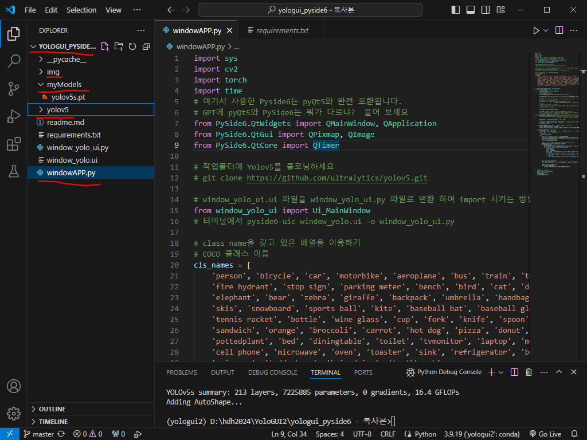
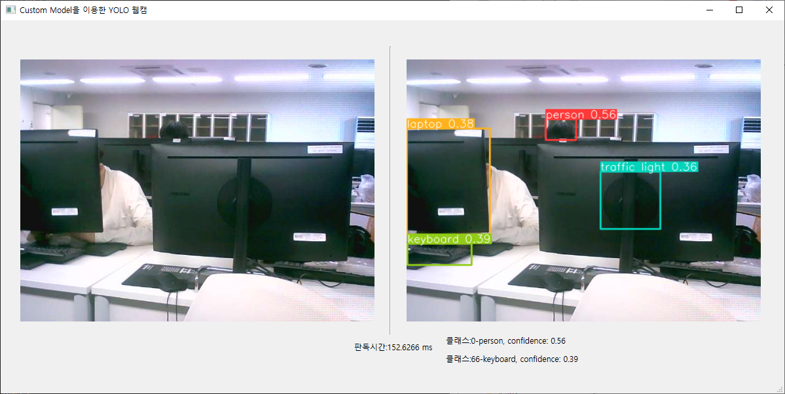

# nativeAPP This is a yolov5's Gui program 

1. 새폴더 만들고 CMD 에서 (또는 vscode 터미널에서) 소스코드를 복사
   ```
   git clone 해당 레포 주소
   ```
3. 새로운 개발환경 만들고
   ```
   create -n yologui2 python=3.9
   ```
4. 콘다 Activate 또는 vscode 에서 개발환경 연결해주고
   ```
   conda activate yologui2
   ```
5. 개발환경 Package 설치 하고
   ```
   pip install -r requirements.txt
   ```
6. yolov5를 클로닝해 오고(REPO에서는 보이지 않지만)
   ```
   git clone https://github.com/ultralytics/yolov5.git
   
7. 다음과 같은 Tree 구조가 만들어지면 오케이
   
## 폴더구조는 


8. 실행은 windowAPP.py

## 프로그램 실행 결과는 


